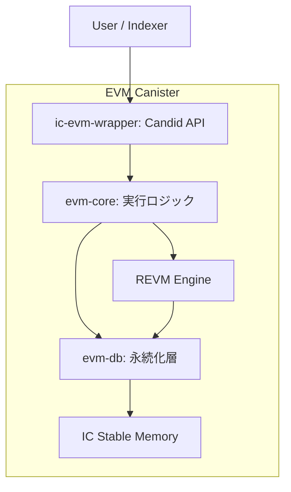

# IC-OP Whitepaper（Investor Edition）

最終更新: 2026-02-03

---

## 重要: インストール運用ルール（必読）

- `ic-evm-wrapper` の install 時は `InitArgs` が必須です（`Some(InitArgs)` を必ず渡す）。
- 空引数 install（`()` / `null` / `opt none` / 引数省略）はサポートしません。
- 推奨: `scripts/lib_init_args.sh` の `build_init_args_for_current_identity` を使って `--argument` を生成してください。
- `rpc_compat_e2e` 実行前は `scripts/run_rpc_compat_e2e.sh` を使い、最新wasmを再ビルドしてから検証してください。

---

## 0. 免責事項

本書は、IC-OP（Internet Computer上のEVM互換実行レイヤー）の技術と事業計画を説明するための資料です。  
法的・税務・投資助言を提供するものではありません。将来見通しには不確実性が含まれます。

---

## 1. Executive Summary

IC-OPは、**「EVM互換 + Canisterネイティブ運用」**を両立する実行基盤です。  
従来のノード運用型L2と異なり、主要機能をInternet ComputerのCanister内に閉じ込めることで、次を狙います。

- ノード運用負荷を下げる（運用の単純化）
- 状態の永続化とアップグレード安全性を高める（Stable Memory前提）
- 長期運用で問題になる履歴肥大化を、内蔵プルーニングで制御する
- Indexer向けに安全な読み取りAPIを提供し、データ利活用を容易にする

投資仮説としては、**開発者体験（DX）と運用コストの差分**が、導入速度・継続率・収益性に波及する点を重視します。

---

## 2. Why Now（なぜ今か）

### 2.1 市場側の課題

- EVMアプリ需要は継続しているが、実運用ではノード管理・データ保守が重い
- 履歴データの増加で、保存コストと同期コストが長期的に効率を下げる
- スケーリング選択肢が多い一方、運用設計が複雑で導入障壁が高い
- ICPではコールの非同期性により、EVM系DeFiで一般的な同期的atomic composabilityをそのまま再現しにくい
- その結果、クロスプロトコル取引設計が複雑化し、流動性集約の難易度を高める要因になり得る

### 2.2 技術側の機会

- Internet ComputerのCanister/Stable Memoryを活かすと、状態管理モデルを再設計できる
- 永続化・エクスポート・プルーニングを一体設計することで運用の予見性を上げられる

---

## 3. Product Thesis（製品仮説）

IC-OPは、次の3要素を一体で提供します。

1. **EVM実行互換**: REVMベースの実行
2. **状態のオンチェーン永続化**: Stable Memory中心のデータ管理
3. **運用継続性**: プルーニングとエクスポートAPIによる長期運用最適化

これにより、「早く作れる」だけでなく、**「長く安定運用できる」EVM基盤**を目指します。

---

## 4. 技術アーキテクチャ（投資家向け要約）

### 4.1 レイヤー構成

- `ic-evm-wrapper`: 外部公開API（Candid）
- `evm-core`: トランザクション処理、順序付け、ブロック生成
- `evm-db`: Stable Memory上の状態保存、履歴保存、プルーニング

### 4.2 差別化ポイント（技術モート）

- **決定論的順序付け**: 手数料と到着順で一貫した処理順を維持
- **アップグレード配慮**: pre/post upgradeフック前提の設計
- **履歴肥大化対策**: 2段階削除（Quarantine → Free）で安全に再利用
- **外部連携の安全性**: 読み取り専用カーソルAPIによる同期

### 4.3 IC Synthetic（中核機能）

IC Syntheticは、ひと言でいうと**「ICPアプリの利用者を、EVM側でも同じ人として安全に扱うための仕組み」**です。  
`submit_ic_tx`（キュー投入）と`execute_ic_tx`（その場で実行）の2つの使い方があります。

1. **なりすましを防ぐ**  
   ICPのユーザーID（Principal）から、EVM側の送信者アドレスを自動で決めます。  
   これにより「誰の操作か」がブレません。

2. **取引フォーマットを固定する**  
   送金先、金額、手数料、nonce、データの並びを固定し、解釈のズレを防ぎます。  
   その結果、実装が増えても同じルールで処理できます。

3. **取引IDを一意にする**  
   取引IDは、取引データだけでなく呼び出し元情報も含めて作ります。  
   似たデータでも別ユーザー・別文脈なら別IDになるため、追跡と監査がしやすくなります。

4. **順番の事故を防ぐ（nonce管理）**  
   送信順が正しい取引だけを受け付け、古い取引や飛び番は拒否します。  
   DeFiや決済で問題になりやすい二重実行・順序崩れの抑制に効きます。

5. **ビジネス上の意味**  
   技術的には地味ですが、運用では非常に重要です。  
   「誰が」「何を」「どの順番で」実行したかを後から説明できるため、金融系・業務系の信頼性を高めます。

---

## 5. ユースケースと顧客

### 5.1 主要顧客セグメント

- EVM互換アプリを短期間で提供したい開発チーム
- インフラ運用コストを抑えたいプロトコル運営者
- データ分析・可視化基盤を持つインデクサー事業者

### 5.2 主要ユースケース

- DeFi・決済系の高頻度トランザクション処理
- ゲーム/NFTの高速状態更新
- エンタープライズ向けの監査可能なスマートコントラクト実行
- ICP dAppからのバックエンド実行基盤（Canister間連携でのEVM機能呼び出し）
- AI Agent/データAPI向けの従量課金エンドポイント運用

### 5.3 ICP dAppとの連結方針

- **Canister-to-Canister連携**: ICP dAppの業務Canisterから`submit_ic_tx` / `execute_ic_tx`を直接呼び出し可能
- **呼び出し主体の継承**: `msg_caller`（Principal）を`IC Synthetic`でEVM送信者へ決定論的に写像
- **責務分離**: UI/業務ロジックはdApp側、資産実行と状態遷移はIC-OP側に分離
- **監査容易性**: Principal文脈を含む`tx_id`により、dApp操作とEVM実行結果の追跡がしやすい

### 5.4 x402とのスムーズな統合

- **入口設計**: APIゲートウェイ層で`HTTP 402 Payment Required`の支払いフローを処理し、決済後にIC-OPの実行APIを呼び出す
- **従量課金との親和性**: `execute_ic_tx`を「1リクエスト=1実行」の課金単位として扱いやすい
- **実装の最小化**: x402の検証/決済ロジックは外部レイヤー、IC-OPはEVM実行に集中（変更影響を局所化）
- **将来拡張**: ネットワーク/資産の選択はx402側で抽象化し、IC-OPはチェーン実行の一貫性を維持

---

## 6. 収益モデル（現時点の設計方針）

現時点では、次の3系統を想定しています。

1. **トランザクション関連収益**  
   基本的には手数料設計（Base Fee + Priority Fee）に依存

2. **運用・提供価値に対する収益**  
   マネージド運用、SLA、監視、サポート等の付加価値

3. **データ関連収益**  
   Indexer・分析基盤向けの高付加価値データ提供（将来）

注: トークン発行・配分・解禁スケジュールは、現時点では未確定です。確定時は別紙で開示します。

---

## 7. Go-To-Market（GTM）

### フェーズA: 開発者獲得

- SDK/サンプル/移行ガイド整備
- 既存EVM dAppの移植事例を作る

### フェーズB: 事例拡大

- Indexerと連携した運用テンプレートを提供
- 重点分野（DeFi・ゲーム）でリファレンス案件を形成

### フェーズC: 収益最適化

- 運用監視・データ提供など有償プラン化
- パートナー経由で導入チャネルを増やす

---

## 8. ロードマップ（技術と事業の接続）

### 短期（0-6か月）

- コア機能の安定化（tx処理、ブロック生成、export API）
- ローカル/ステージングでの運用Runbook整備
- 主要障害シナリオ（アップグレード、プルーニング中断）の検証強化

### 中期（6-12か月）

- Indexer運用の自動化と監視指標整備
- 高頻度ユースケース向け性能改善
- 外部監査とセキュリティテストの実施

### 長期（12か月以降）

- 商用運用を前提としたSLA設計
- パートナー連携の拡大
- ガバナンス/トークン設計（必要時）を段階的に公開

---

## 9. KPIフレーム（投資家モニタリング用）

### 9.1 成長KPI

- 月間アクティブウォレット（MAW）
- 1日あたりトランザクション数（TPSではなく実利用件数）
- 継続利用dApp数

### 9.2 収益KPI

- 手数料総額（Gross）
- インフラ原価控除後の純収益（Net）
- 顧客獲得コスト回収期間（Payback）

### 9.3 品質KPI

- ブロック生成成功率
- APIエクスポート成功率
- 障害復旧時間（MTTR）

---

## 10. リスクと対策

1. **実装バグ・障害リスク**  
   テスト強化、段階リリース、障害Runbook運用で緩和

2. **需要不確実性**  
   特定セグメント（DeFi/ゲーム）に絞った検証でPMF探索を高速化

3. **規制・会計リスク**  
   法務/税務アドバイザーと連携し、地域ごとの運用方針を分離

4. **競争激化**  
   「運用の簡潔さ」と「長期データ管理」の実装品質で差別化

---

## 11. 技術仕様サマリ（既存ドラフト反映）

- World State（Account/Storage/Code）とチェーン履歴をStable Memoryに保存
- `ReadyKey`による決定論的なTx順序付け（Fee優先 + 到着順）
- `TxLoc`で`Queued / Included / Dropped`を追跡
- `export_blocks(cursor, max_bytes)`で安全に分割取得
- プルーニングは`retain_days / retain_blocks / target_bytes`の複合条件で実行
- 削除は`Quarantine -> Free`の2段階とジャーナル回復で整合性を維持

---

## 12. DD（デューデリ）時の確認ポイント

投資判断での技術DDでは、以下を優先確認してください。

- メモリレイアウト互換性（アップグレード時）
- プルーニング中断時の回復整合性
- Indexer再同期時のデータ欠損耐性
- テストカバレッジ（単体・統合・E2E）の継続更新状況

---

## 13. Closing

IC-OPは、EVM互換性だけでなく、**運用継続性をプロダクトの中心に据えた実行基盤**です。  
