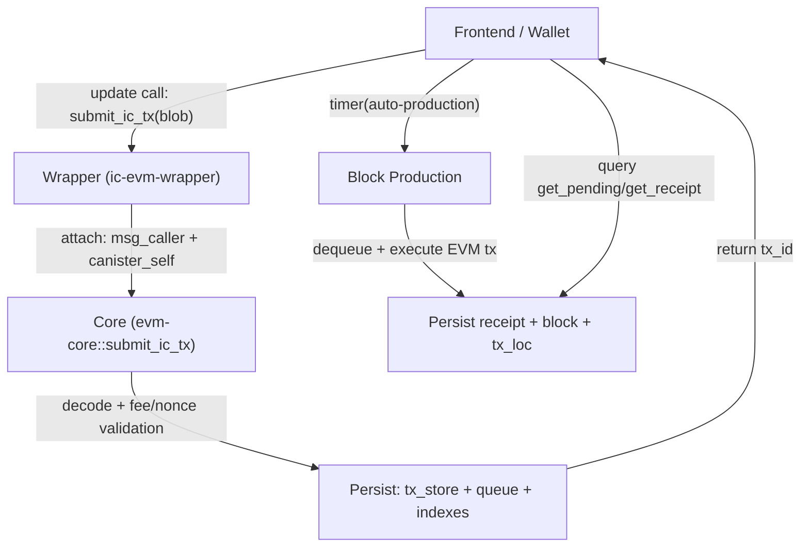
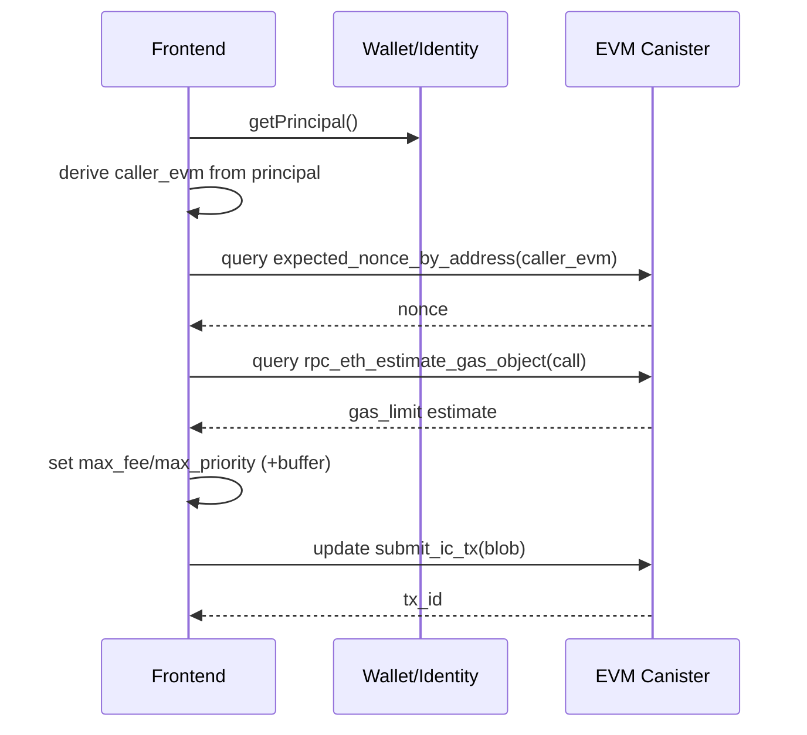

# EVM互換Canister開発プロジェクト計画書


[](https://dashboard.internetcomputer.org/canister/4c52m-aiaaa-aaaam-agwwa-cai)
[](https://dashboard.internetcomputer.org/)


## Disclaimer

Azle stable mode is continuously subjected to intense scrutiny and testing, however it has not yet undergone intense security review.


## Chain / RPC情報（運用サマリ）

| 項目 | 値 |
| --- | --- |
| 環境名 | testnet（現行運用名） |
| ネットワーク | `kasane` |
| Canister ID | `4c52m-aiaaa-aaaam-agwwa-cai` |
| Chain ID | `4801360` |
| RPC URL | `https://rpc-testnet.kasane.network` |
| Explorer URL | `https://explorer-testnet.kasane.network` |

運用メモ:
- `eth_sendRawTransaction` の成功判定は submit結果ではなく `eth_getTransactionReceipt.status` で行う（`0x1` 成功 / `0x0` 失敗）。
- nonce参照は `eth_getTransactionCount`（Gateway）または `expected_nonce_by_address`（canister query）を使用する。
- testnet indexer の正式起点 cursor は `{"v":1,"block_number":"25","segment":0,"byte_offset":0}`（先頭履歴の `MissingData` 回避）。
- `/ops` 監視閾値（固定）:
  - `failure_rate_warn >= 0.05`（10分継続）
  - `failure_rate_critical >= 0.20`（10分継続）
  - `cursor_lag_warn > 50`, `cursor_lag_critical > 200`（いずれも10分継続）
  - `pending_stall=true` は即時warn

Explorer の実装詳細（ルート一覧・lib層責務）は `tools/explorer/README.md` を参照。

## 運用上の決定事項（2026-02-04）

- InitArgs: Candidは service : (opt InitArgs) を維持するが、互換性維持目的であり runtime では None を拒否する。
- 互換ターゲットは Ethereum JSON-RPC + EVM 実行意味論に固定し、OP/Superchain互換は非目標とする。
- ネイティブ通貨運用（2026-02-11）:
  - 表示上のネイティブ通貨は `ICP` とする。
  - 単位は EVM 慣例どおり `10^18` 最小単位（`1 ICP = 10^18`）で扱う。
  - `base_fee` / `gas_price` / `max_fee_per_gas` は上記単位の `ICP` 建てとして解釈する。
  - 本方針は「単位・表示」の定義であり、ICP Ledger 残高を各Txで直接参照してガス徴収する仕様ではない。
- submit系APIの役割:

  | API | 用途 | 同期性 | 戻り値 |
  | --- | --- | --- | --- |
  | submit_ic_tx | 後続ブロックで実行するためのキュー投入 | 非同期 | tx_id |
  | rpc_eth_send_raw_transaction | 後続ブロックで実行するためのキュー投入 | 非同期 | tx_id |

- submit系APIの返却コード（PR8）は `docs/specs/pr8-signature-boundary.md` を正本とする。
  - 主要コードは `README.md` にも掲載し、更新時は正本と同時に同期する。
- submit系APIの返却コード（PR8, 主要一覧）:

  | 種別 | コード |
  | --- | --- |
  | Ingress submit (`submit_ic_tx` / `rpc_eth_send_raw_transaction`) | `arg.tx_too_large`, `arg.decode_failed`, `arg.unsupported_tx_kind`, `submit.tx_already_seen`, `submit.invalid_fee`, `submit.nonce_too_low`, `submit.nonce_gap`, `submit.nonce_conflict`, `submit.queue_full`, `submit.sender_queue_full`, `internal.unexpected` |
  | pre-submit guard（共通） | `auth.anonymous_forbidden`, `ops.write.needs_migration`, `ops.write.cycle_critical` |
  | pre-submit guard（`rpc_eth_send_raw_transaction` のみ） | `rpc.state_unavailable.corrupt_or_migrating` |
  | execute path（wrapper 側） | `exec.*` |
- `submit_ic_tx` の入力仕様（README要約）:
  - 引数: `vec nat8`（以下の固定バイトレイアウト）
  - レイアウト（Big Endian）:
    - `[version:1][to:20][value:32][gas_limit:8][nonce:8][max_fee_per_gas:16][max_priority_fee_per_gas:16][data_len:4][data:data_len]`
  - 必須条件:
    - `version = 2`
    - `data_len` と `data` 実長が一致
  - 戻り値: `tx_id`（32 bytes, internal id）
- `submit_ic_tx` の全体フロー（実装準拠）:
  - フロントが `submit_ic_tx(blob)` を update call で呼ぶ。
  - wrapper が `msg_caller()` と `canister_self()` を付与して core の `TxIn::IcSynthetic` に渡す。
  - core が `IcSynthetic` としてデコード/fee/nonce を検証し、`tx_store`/queue/index に保存する。
  - 戻り値は `tx_id` のみ（この時点では未実行）。
  - `auto-production` がキューから取り出して実行し、`receipt` を永続化する。



- `submit_ic_tx` blob の詳細（IcSynthetic v2, Big Endian）:

  | Field | Size (bytes) | 説明 |
  | --- | ---: | --- |
  | `version` | 1 | 固定 `2` |
  | `to` | 20 | 宛先EVMアドレス |
  | `value` | 32 | 送金量 (`uint256`) |
  | `gas_limit` | 8 | gas上限 (`uint64`) |
  | `nonce` | 8 | sender nonce (`uint64`) |
  | `max_fee_per_gas` | 16 | EIP-1559 max fee (`uint128`) |
  | `max_priority_fee_per_gas` | 16 | EIP-1559 tip (`uint128`) |
  | `data_len` | 4 | `data` バイト長 (`uint32`) |
  | `data` | `data_len` | calldata |

- `from`（送信者）決定方法:
  - `submit_ic_tx` では `from` を payload に含めない。
  - 実行時の sender は `msg_caller()` の Principal から決定的に導出した `caller_evm`（20 bytes）を使う。
  - 導出規則は `@dfinity/ic-pub-key` 準拠（Chain Fusion Signerの `[0x01, principal_bytes]` 派生鍵からEthereum address化）。
  - 実装は `derive_evm_address_from_principal(...) -> Result<[u8;20], AddressDerivationError>` を使い、
    導出失敗時にゼロアドレスへフォールバックしない（`InvalidArgument: arg.principal_to_evm_derivation_failed`）。
  - `encodePrincipalToEthAddress` 相当の bytes32 エンコードは **EVMアドレス導出ではない**。
    address引数には常に20 bytesのEVMアドレスを使う。
  - このため同一 Principal なら同一 sender になり、nonce はこの sender 単位で管理される。


- `submit_ic_tx` の送信前チェック（推奨）:
  - `caller_evm` を Principal から導出
  - `expected_nonce_by_address(caller_evm)` で nonce 取得
  - `rpc_eth_estimate_gas_object(...)` で gas 見積り
  - feeにバッファを乗せて `submit_ic_tx` を送信



- `tx_id` の意味:
  - `tx_id` は `raw + caller_evm + canister_id + caller_principal` を入力にした内部識別子。
  - したがって `submit_ic_tx` の `tx_id` は `eth_tx_hash` とは別物で、追跡は `tx_id` を正とする。
- `submit_ic_tx` 実行例（testnet）:

```bash
CANISTER_ID=4c52m-aiaaa-aaaam-agwwa-cai
IDENTITY=ci-local

TX_HEX=$(python - <<'PY'
version = b'\x02'
to = bytes.fromhex('0000000000000000000000000000000000000001')
value = (0).to_bytes(32, 'big')
gas_limit = (500000).to_bytes(8, 'big')
nonce = (0).to_bytes(8, 'big')
max_fee = (2_000_000_000).to_bytes(16, 'big')
max_priority = (1_000_000_000).to_bytes(16, 'big')
data = b''
data_len = len(data).to_bytes(4, 'big')
print((version + to + value + gas_limit + nonce + max_fee + max_priority + data_len + data).hex())
PY
)

icp canister call -e ic --identity "$IDENTITY" "$CANISTER_ID" submit_ic_tx "(vec { $(python - <<PY
tx = bytes.fromhex('$TX_HEX')
print('; '.join(str(b) for b in tx))
PY
) })"
```
- `rpc_eth_send_raw_transaction` の入力仕様（README要約）:
  - 引数: `blob`（署名済み Ethereum raw transaction の生バイト列）
  - 対応: Legacy(RLP), EIP-2930, EIP-1559
  - 非対応: EIP-4844(`0x03`), EIP-7702(`0x04`)
  - 戻り値: `tx_id`（32 bytes, internal id）
- `rpc_eth_send_raw_transaction` 実行例（testnet）:

```bash
CANISTER_ID=4c52m-aiaaa-aaaam-agwwa-cai
IDENTITY=ci-local
CHAIN_ID=4801360
PRIVKEY="<YOUR_PRIVKEY_HEX>"

RAW_TX_BYTES=$(cargo run -q -p ic-evm-core --features local-signer-bin --bin eth_raw_tx -- \
  --mode raw \
  --privkey "$PRIVKEY" \
  --to "0000000000000000000000000000000000000001" \
  --value "0" \
  --gas-price "1000000000" \
  --gas-limit "21000" \
  --nonce "0" \
  --chain-id "$CHAIN_ID")

SUBMIT_OUT=$(icp canister call -e ic --identity "$IDENTITY" "$CANISTER_ID" rpc_eth_send_raw_transaction "(vec { $RAW_TX_BYTES })")
echo "$SUBMIT_OUT"

# 実行確定は自動採掘（必要なら block number を監視）
icp canister call -e ic --identity "$IDENTITY" --query "$CANISTER_ID" rpc_eth_block_number '( )'
```

- 詳細手順（`tx_id` 抽出と `get_receipt` まで）は `docs/api/rpc_eth_send_raw_transaction_payload.md` を参照。

### RPCハッシュ運用（2026-02-08）

- `tx_id` は canister 内部識別子（保存・参照の主キー）。
- `eth_tx_hash` は Ethereum 互換の raw tx hash (`keccak256(raw_tx)`)。
- 参照APIは `rpc_eth_get_transaction_by_eth_hash` / `rpc_eth_get_transaction_receipt_by_eth_hash` を正とする。
- 旧 `tx_id` 前提の参照RPCは廃止した。
- `eth_call` は raw tx 入力の `rpc_eth_call_rawtx` として公開する。
- `rpc_eth_get_logs_paged` は `GetLogsErrorView` を返し、`RangeTooLarge` / `TooManyResults` / `UnsupportedFilter` / `InvalidArgument` を明示する。
- `rpc_eth_get_logs_paged` の `limit=0` は `1` に正規化する（空ページ継続を防止）。
- `ChainStateV1::new()` の `auto_production_enabled` 既定値は `true`（タイマー駆動の自動ブロック生成が既定）。
- storage書き込み失敗は `trap` でロールバックするため、canister内カウンタは残らない。一次監視は caller/indexer 側ログで行う。
- デプロイ前の統合スモークは `scripts/predeploy_smoke.sh` を利用する。
- デプロイ後の最小RPC確認は `scripts/mainnet/ic_mainnet_post_upgrade_smoke.sh` を利用する（`EVM_RPC_URL` と任意で `TEST_TX_HASH` を指定）。
- `scripts/mainnet/ic_mainnet_deploy.sh` は `RUN_POST_SMOKE=1` で post-upgrade smoke を自動実行できる（`POST_SMOKE_RPC_URL` / `POST_SMOKE_TX_HASH` で上書き可能）。
- 容量対策として、必要時は `cargo clean` を実行して `target/` を都度クリーンする。
- 運用時の初期資金配布は `InitArgs.genesis_balances` に一本化する。

## 1.0 序論：プロジェクトのビジョンと全体戦略

本プロジェクトは、Internet Computer Protocol (ICP) の独自のアーキテクチャを最大限に活用し、高性能かつユニークなEVM（Ethereum Virtual Machine）互換環境をcanister上に構築することをビジョンとして掲げます。我々はICPの特性である同期的な関数呼び出しやcanister間のシームレスな連携能力を活かし、「ICPから呼び出して嬉しいEVM」という新たな価値を提供することを目指します。このアプローチは、単なるEthereumの拡張ではなく、ICPエコシステムとEVMエコシステムの双方に新たな可能性をもたらす戦略的選択です。
このビジョンを実現するため、プロジェクト全体を導く基本方針として以下の3点を定めます。
- 同期的な開発体験の提供 プロジェクトの核となる価値は、ICP canister からEVM実行結果に到達する導線を明確に保つ点にあります。現行実装では `submit_*` は非同期のキュー投入であり、実行結果（成功、失敗、返り値）は `auto-production` 後に receipt/参照API で確認します。この運用により、従来の非同期モデルに比べて実行フェーズの観測点を明示しやすく、ICP上のワークフローや他canisterとの連携にEVMロジックを組み込みやすくなります。
- RPCの戦略的ポジショニング 我々はHTTP JSON-RPCインターフェースを、敢えてEthereumノードの完全互換を目指すのではなく、「開発・デバッグ・外部ツール接続のための補助的なインターフェース」と位置づける戦略的判断を下します。このトレードオフにより、mempoolや複雑なフィルター機能といった実装負荷の高い仕様を意図的に後回しにし、開発リソースをプロジェクト独自の価値である同期実行体験の向上に集中させることができます。
これらの戦略的アプローチは、プロジェクトを現実的かつ持続可能な形で推進するための羅針盤です。以降のセクションでは、この全体戦略に基づき、各開発フェーズにおける具体的な技術的決定と目標を詳述します。

## 2.0 Phase 0: 仕様凍結 — 将来の互換性を保証する不変の土台

この初期フェーズの目的は、プロジェクトの技術的基盤の中で、将来にわたって変更が許されない「決定性」に関わる中核仕様を定義し、凍結することです。開発の初期段階でこれらの不変のルールを確立することにより、将来的な仕様変更に伴う大規模な手戻りや、アップグレード時に状態の互換性が失われるといった致命的なリスクを未然に防ぎます。本フェーズの核心は、「決定性が壊れる種を先に潰すこと」であり、システムの長期的な信頼性と安定性を担保する上で最も重要な工程です。

### 2.1 メモリレイアウトとキー空間の凍結

永続化データのレイアウトは、アップグレード耐性の根幹をなします。本プロジェクトでは、ic-stable-structuresのMemoryManagerを利用し、Stable Memoryの各領域に固定のMemoryIdを割り当てます。このレイアウトを一度凍結することで、将来のアップグレード時にもデータ構造が破壊されることなく、安全に状態を引き継ぐことが可能になります。crates/evm-db/src/memory.rsで定義されたAppMemoryIdの完全なレイアウトは以下の通りです。

| MemoryId | 名称 | 用途 |
| --- | --- | --- |
| 0 | UPGRADES | heap上の軽量データをアップグレード時に退避・復元するための予約領域 |
| 1 | META | magic number, version, schema hash等を保存し、起動時に互換性を検証 |
| 2 | ACCOUNTS | EVMアカウントの基本情報（nonce, balance, code hash）を格納 |
| 3 | STORAGE | EVMコントラクトのストレージデータを格納 |
| 4 | CODES | EVMコントラクトのバイトコードを格納 |
| 5 | StateAux | 将来のStateDB拡張用の予約領域 |
| 6 | QueueMeta | トランザクションキューのメタデータ（head/tail）を格納 |
| 7 | Queue | 未処理トランザクションIDのキューを格納 |
| 8 | SeenTx | 処理済みトランザクションIDの重複防止セットを格納 |
| 9 | TxStore | トランザクション本体（Envelope）を格納 |
| 10 | TxIndex | トランザクションIDからブロック位置へのインデックスを格納 |
| 11 | Receipts | トランザクションの実行結果（Receipt）を格納 |
| 12 | Blocks | ブロックデータを格納 |
| 13 | Head | チェーンの最新ブロック情報を格納 |
さらに、StateDB（Accounts, Storage, Codes）内のキー空間設計も凍結します。キーは、データの種類を識別するためのバイトプレフィックスを先頭に付与した固定長のバイト列です。crates/evm-db/src/types/keys.rsで定義されるキー構造は以下の通りです。
- AccountKey: 0x01 || addr20 (21 bytes)
- StorageKey: 0x02 || addr20 || slot32 (53 bytes)
- CodeKey: 0x03 || code_hash32 (33 bytes)
このプレフィックス設計により、キーの辞書順がデータの種類（Account < Storage < Code）とアドレスによって一意に定まります。これにより、異なる種類のデータがキー空間上で衝突することを防ぎ、決定的かつ効率的なデータアクセス（特に範囲検索や全件走査）が保証されます。この順序付けはcrates/evm-db/tests/phase0_ordering.rsのkey_prefix_ordering_is_stableテストによって恒久的に検証されます。

### 2.2 データエンコーディングとコミット順序の定義

データのシリアライズ形式も、決定性を保証するために凍結されるべき重要な仕様です。AccountValやU256Valといった主要な値の型は、crates/evm-db/src/types/values.rsで定義される通り、固定長のバイト列としてエンコードされます。これにより、データの解釈が一意に定まり、将来のバージョンにおいても前方互換性が維持されます。このルールはstorable.rsにおけるStorableトレイトの実装によって強制され、長さが不正なデータはデシリアライズ時にトラップすることで、データの破損を防ぎます。
状態遷移の再現性を保証するもう一つの根幹は、コミットの順序です。トランザクション実行中の状態変更は、まずメモリ上のOverlayDBに記録されます。overlay.rsで定義されている通り、このOverlayDBは内部的にBTreeMap（キーでソートされたマップ）を使用しており、永続化層へコミットする際には、常にキーの昇順で変更が適用されます。この「OverlayDBのコミット順序はキーの昇順である」というルールを凍結することで、同一のトランザクションを実行すれば、誰がいつ実行しても全く同じ順序で状態が更新され、最終的な状態が完全に一致することが保証されます。

### 2.3 Phase 0の成果物と合格条件

このフェーズの完了は、以下の成果物とテスト条件によって定義されます。
- 成果物:
  - 仕様書 (spec.md): 凍結されたメモリレイアウト、キー空間、エンコーディング、コミット順序等のルールを明記したドキュメント。
  - Golden Vectors: 特定の入力（例: Principal）から特定の出力（例: EVMアドレス）を生成するテストケース集。仕様の具体的な実装例として機能します。
- 合格条件（テスト項目）:
  - キーの辞書順検証: AccountKeyとStorageKeyなどがプレフィックスによって正しく順序付けられることを確認する。
  - Storable Roundtrip: すべての凍結されたデータ型が、to_bytesとfrom_bytesを経由しても元の値と一致すること、および不正な長さのデータは拒否されることを検証する。
  - OverlayDBのコミット順序検証: 異なる順序でデータを挿入しても、コミットされる順序が常にキーの昇順であることを確認する。
  - Metaデータ検証: 初回起動時に正しいMetaデータが書き込まれ、二回目以降の起動でそのデータが検証され、不正な場合はトラップすることを確認する。
この凍結された堅牢な土台の上に、次のフェーズでは実際のEVM実行エンジンを構築し、トランザクション処理の心臓部を実装していきます。

## 3.0 Phase 1: 実行基盤 — "同期Tx体験"の実現

Phase 0で確立した不変の土台の上に、submit/produceモデルでEVM実行を安定提供する基盤を技術的に実現するのがPhase 1です。このフェーズの主目的は、外部ツールとの接続を担うRPCインターフェースよりも先に、「投入→実行→参照」の導線を確立することにあります。これにより、開発者は canister ワークフローにEVM実行を組み込み、実行結果をreceipt/参照APIで追跡できるようになります。

### 3.1 技術アーキテクチャ：REVMとStable Structuresの統合

この同期実行体験を実現するため、高性能EVM実行エンジンであるREVMと、ICPの永続化ストレージであるStable Structuresを統合します。このアーキテクチャパターンでは、メモリ上のOverlayDBに変更をバッチし、「Committer」がそれを決定的な順序で永続化層に適用します。
[REVM Engine] -> [Database Adapter (RevmStableDb)] <-> [OverlayDB (RAM)] -> [Committer] -> [StableBTreeMap (Stable Memory)]
このパターンの具体的な実装がcrates/evm-core/src/revm_db.rsのRevmStableDbです。これはREVMのDatabaseトレイトを実装したアダプタであり、EVMの状態読み取りをStableBTreeMapにブリッジします。さらに、DatabaseCommitトレイトを実装することで、REVMの実行結果（状態差分）を受け取り、それを直接StableStateのマップ群に書き込むことで「Committer」の役割を果たします。
この実行基盤を外部に公開する主要な書き込み導線は、crates/ic-evm-wrapper/src/lib.rsで定義されたsubmit_* + auto-productionです。これらのupdate callを通じて、内部ではcrates/evm-core/src/chain.rsの実行ロジックが段階的に適用されます。
1. 受け取ったトランザクションをデコードする。
2. REVMエンジンを用いてトランザクションを実行し、状態変更をコミットする。
3. 更新後の状態から新しいstate_rootを計算する。
4. 決定的なルールに基づき新しいblock_hashを計算する。
5. この「1トランザクションのみを含む新しいブロック」を永続化し、チェーンのHeadを更新する。
処理が完了するとreceipt/tx参照APIから結果を取得でき、運用上は単一のsubmit導線で制御できます。

### 3.2 決定性の保証

ICPのcanisterは、コンセンサスを通じてすべてのレプリカが同じ状態に至る「決定性」が求められます。本プロジェクトのEVM実行においても、この決定性を厳密に保証するためのルールを設けています。
- ブロック情報の決定的生成: crates/evm-core/src/hash.rsで定義されている通り、ブロックのメタデータは外部の不確定な要素に依存せず、完全に決定的に生成されます。
  - タイムスタンプ: parent.timestamp + 1 のように、親ブロックのタイムスタンプに固定値を加算して計算します。
  - tx_list_hash: ブロックに含まれるトランザクションIDのリストから、順序を考慮して決定的に計算されます。
  - ブロックハッシュ: block_hash関数は、親ブロックハッシュ、ブロック番号、タイムスタンプ、tx_list_hash、そしてステートルートといった全ての決定的な入力から、一意のハッシュ値を算出します。
- ステートルートの計算: Phase 1では、性能よりも計算の正確性と再現性を最優先します。crates/evm-core/src/state_root.rsのcompute_state_root関数は、StableBTreeMapに保存されている全てのアカウント、ストレージ、コードデータを全件走査し、それらを連結したもののハッシュを計算します。このアプローチは計算コストが高いものの、状態が完全に一致すれば必ず同じステートルートが生成されることを保証し、システムの正しさを検証するための確実な基準となります。
これらの仕組みにより、同一のトランザクションシーケンスが与えられた場合、どのレプリカで実行されても、常に同一の状態遷移、同一のステートルート、そして同一のブロックハッシュが生成されることが保証されます。

### 3.3 Phase 1の成果物と合格条件

このフェーズの完了は、以下の基準が満たされることで検証されます。
- 同一トランザクション列の再現性: 同一のトランザクション列を複数回実行した際に、最終的なstate_rootが完全に一致すること。
- アップグレード耐性: canisterをアップグレードした後も、既存の状態（アカウント、ストレージ、ブロック履歴）が破壊されず、正常に動作し続けること。
- 書き込み導線の機能: submit_* + auto-production 経路で、トランザクションの成功（success）または失敗（revert）のステータスがreceipt経由で正しく取得できること。
このコア実行基盤が完成したことで、プロジェクトは独自の価値を持つエンジンを手に入れました。次のフェーズでは、この強力なエンジンを外部の開発者エコシステムに接続するための窓口となる、RPC層の実装へと進みます。

## 4.0 Phase 2: RPCノード化 — 開発者体験の構築

Phase 1で構築した独自のコア実行エンジンは、それだけでは閉じた世界に留まります。Phase 2の目的は、このエンジンを外部の開発者や標準的なツール（Viem, Ethers, Foundryなど）が利用できるようにするための「窓口」として、HTTP JSON-RPCインターフェースを実装することです。このフェーズは、プロジェクトを単なる技術的証明から、開発者が実際に触れてアプリケーションを構築できるプラットフォームへと昇華させる重要なステップです。
本フェーズにおいて我々が下す重要な戦略的判断は、「仕様の割り切り」です。目標はEthereumノードの完全な互換性を達成することではなく、開発、デバッグ、ツール接続に必要となる最低限のRPCメソッドを戦略的に提供することにあります。このトレードオフにより、pending/mempoolやfilter WebSocketのような実装負荷の高い機能（「沼回避」）を意図的に後回しにし、迅速に開発者体験の基盤を構築します。

### 4.1 RPC実装方針

RPCインターフェースは、Internet Computerのアーキテクチャに準拠した形で実装されます。
- HTTPエンドポイントの分離: ICの実行モデルに従い、状態を読み取るだけのRPCメソッドは**http_request (query call)で処理し、状態を変更する可能性のあるメソッドはhttp_request_update (update call)**で処理します。この明確な分離により、読み取り系の操作は高速かつ安全に実行され、書き込み系の操作はコンセンサスを経て確実に処理されることが保証されます。
- 実装メソッドの戦略的選択: 開発者体験を最大化するため、実装するRPCメソッドには優先順位をつけます。
  - 実装対象メソッド (最小ノードセット): 開発者がツールを接続し、基本的なコントラクトのデプロイ、読み取り、トランザクション送信を行えるようにするために不可欠なメソッド群です。
    - eth_chainId, eth_blockNumber (チェーンの基本情報)
    - eth_getBlockByNumber, eth_getTransactionReceipt (ブロックとトランザクションの参照)
    - eth_call, eth_getBalance, eth_getCode (状態の読み取り)
    - eth_sendRawTransaction (トランザクションの送信)
  - 実装見送り対象メソッド: 実装が複雑で、初期の開発サイクルにおいては必須ではないと判断されたメソッド群です。これらを意図的に除外することで、開発リソースをコア機能に集中させます。
    - pending/mempool関連: 本システムは即時実行モデルを基本とするため、pending状態の概念は適用しません。
    - filter/WebSocket関連: `eth_newFilter` / `eth_getFilterChanges` / `eth_subscribe` は現時点で非対応です。
    - なお `eth_getLogs` は完全互換ではなく、制限付き実装です（`topic0` 中心、`topics[1+]` は未対応）。

### 4.1.1 Ethereum JSON-RPC互換表（現行実装）

以下は**現行実装時点**の互換状況です。ここは要約版であり、詳細と更新正本は `tools/rpc-gateway/README.md` を参照してください。

| Method | Status | Current behavior | Limitation | Alternative/Note |
| --- | --- | --- | --- | --- |
| `eth_chainId` | Supported | チェーンIDを返す | なし | 固定値はヘッダーバッジ参照 |
| `eth_blockNumber` | Supported | 最新ブロック番号を返す | なし | - |
| `eth_gasPrice` | Partially supported | 最新ブロックの `base_fee_per_gas` を返す | tip block metadata 依存 | 簡易gas priceとして提供 |
| `eth_syncing` | Supported | `false` を返す | 同期進捗オブジェクトは返さない | 即時実行モデル前提 |
| `eth_getBlockByNumber` | Partially supported | ブロック参照を返す | `latest/pending/safe/finalized` は head 扱い。pruned範囲は `-32001` | `fullTx` の有無で返却形を切替 |
| `eth_getTransactionByHash` | Supported | `eth_tx_hash` ベースで参照する | `tx_id` 直接参照ではない | canister側は `rpc_eth_get_transaction_by_eth_hash` |
| `eth_getTransactionReceipt` | Partially supported | receipt を返す | migration/corrupt時 `-32000`、pruned範囲は `-32001` | canister側は `rpc_eth_get_transaction_receipt_with_status_by_eth_hash` |
| `eth_getBalance` | Partially supported | 残高取得に対応 | `latest` 系のみ（文字列または `{ blockNumber: "latest|pending|safe|finalized" }`） | canister query でも取得可能 |
| `eth_getTransactionCount` | Partially supported | nonce取得に対応 | `latest/pending/safe/finalized` のみ | canister側 `expected_nonce_by_address` |
| `eth_getCode` | Partially supported | コード取得に対応 | `latest` のみ | canister query でも取得可能 |
| `eth_getStorageAt` | Partially supported | ストレージ取得に対応 | `latest` のみ | `slot` は QUANTITY / DATA(32bytes) を受理 |
| `eth_call` | Partially supported | 読み取り実行に対応 | `latest` のみ、入力制約あり | revert時は `-32000` + `error.data` |
| `eth_estimateGas` | Partially supported | call相当で見積り | `latest` のみ、入力制約あり | canister側 `rpc_eth_estimate_gas_object` |
| `eth_sendRawTransaction` | Supported | 署名済みtxを投入し、返却 `tx_id` から `eth_tx_hash` を解決して `0x...` を返す | `eth_tx_hash` 解決不能時は `-32000` エラー返却 | canister側投入実体は `rpc_eth_send_raw_transaction` |
| `eth_getLogs` | Partially supported | `rpc_eth_get_logs_paged` を使って取得（`topics[0]` OR配列はGatewayで展開） | 単一address、`topics[1+]` 未対応、`blockHash` は直近 `RPC_GATEWAY_LOGS_BLOCKHASH_SCAN_LIMIT` ブロック走査で解決（既定 `2000`） | 大きい範囲は `-32005` |

注記: `eth_getLogs` で `blockHash` が見つからない場合は `code=-32000`, `message="Block not found."`, `data="0x..."` を返します。

pending/mempool/filter WebSocket 系（例: `eth_newFilter`, `eth_getFilterChanges`, `eth_subscribe`）は、現行実装時点では `Not supported` です。理由は Phase 2 のスコープ（沼回避）による意図的な非対応です。

本ドキュメントの互換表は JSON-RPC 層を対象とし、opcode 実行意味論の差分整理は現時点の対象外です。

従来のEVMチェーンと異なる運用上の注意（現行実装時点）:
- Pruning: 古い履歴は prune される可能性があり、範囲によっては参照RPCが `Pruned` / `PossiblyPruned` を返します。長期保管が必要な履歴は indexer 側で保持してください。
- Timer駆動: 採掘は canister timer で実行します。mining は `set_timer` による単発予約を毎tickで再設定する方式で、`mining_scheduled` フラグで多重予約を防ぎます。
- Timer駆動（mining詳細）: 採掘は自動実行のみを提供します。`ready_queue` が空のときは次回予約のみ行います。
- Timer駆動（停止条件）: 採掘失敗時は基本間隔で再試行します。cycle critical または migration 中は write 拒否により採掘を停止し、復帰後は cycle observer tick が再スケジュールを補助します。prune は block event 駆動（`block_number % 84 == 0`）でのみ試行されます。
- Finalityモデル: 本チェーンは単一シーケンサ前提で、`auto-production` 後のブロックはreorgを前提にしません（Ethereum L1の一般的なfork前提と異なる）。
- Submit/Execute分離: `eth_sendRawTransaction` は投入（enqueue）であり、実行確定は後続の block production 後に反映されます。
- `eth_sendRawTransaction` 戻り値: Gateway は canister `rpc_eth_send_raw_transaction` の返却 `tx_id` から `rpc_eth_get_transaction_by_tx_id` で `eth_tx_hash` を解決して返します。解決不能時は `-32000` エラーを返します。
- `eth_getTransactionReceipt.logs[].logIndex`: ブロック内通番で返します。
- ハッシュ運用: 内部主キー `tx_id` と外部互換 `eth_tx_hash` は別物です。外部連携は `eth_tx_hash` 系参照を使用してください。
- API分離: receipt status は `rpc_eth_get_transaction_receipt_with_status_by_eth_hash`（外部）と `rpc_eth_get_transaction_receipt_with_status_by_tx_id`（内部運用）を使い分けます。

関連定数（現行実装値）:
- mining 基本間隔: `DEFAULT_MINING_INTERVAL_MS = 2_000`（`crates/evm-db/src/chain_data/runtime_defaults.rs`）
- cycle observer 間隔: migration中 `60s` / 通常 `3600s`（`crates/ic-evm-wrapper/src/lib.rs` の `set_timer` 再帰スケジュール）
- prune policy 間隔フィールド: `DEFAULT_PRUNE_TIMER_INTERVAL_MS = 3_600_000`（内部保持値。`set_prune_policy` 入力では未使用）
- prune イベント間隔: `PRUNE_EVENT_BLOCK_INTERVAL = 84` blocks（`crates/ic-evm-wrapper/src/lib.rs`）
- prune 間隔の下限: `MIN_PRUNE_TIMER_INTERVAL_MS = 1_000`（内部保持値向け）
- prune 1tick上限: `DEFAULT_PRUNE_MAX_OPS_PER_TICK = 5_000`
- prune 1tick最小: `MIN_PRUNE_MAX_OPS_PER_TICK = 1`
- backoff 上限: `MAX_PRUNE_BACKOFF_MS = 300_000`
- 運用ルール: 上記の実値変更時は `crates/evm-db/src/chain_data/runtime_defaults.rs` と本READMEを同一PRで同期更新する。

運用ルール: 互換表の更新正本は `tools/rpc-gateway/README.md` とし、メソッド追加・制約変更時は同一PRで本README要約と同期更新します。

### 4.2 Phase 2の合格条件

このフェーズの成功は、外部ツールとの具体的な連携が機能するかどうかで判断されます。
- ツール接続と基本操作:
  - viemやethers.jsといった主要なクライアントライブラリを用いてcanisterに接続できること。
  - 接続したツールから、スマートコントラクトのdeploy、call（読み取り）、sendRawTransaction（書き込み）といった一連の基本操作が正常に完了すること。
- 応答の決定性:
  - canisterが同一の状態にある限り、読み取り系のRPCリクエストに対して常に同一の応答を返すこと。
内部的な実行基盤と外部との接続性が確立されたことで、このEVM環境は技術的に独立したチェーンとして機能するようになりました。
