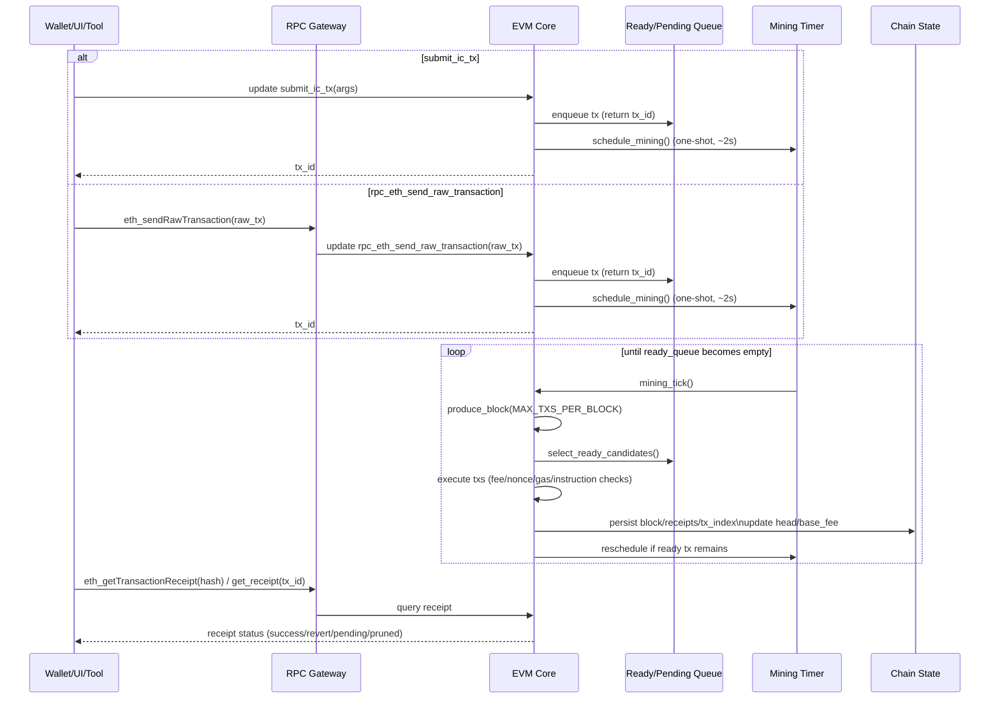

# Kasane Chain (Testnet Alpha): EVM Execution Canister on ICP

Hello everyone — this is an introduction to **Kasane Chain**. We have two simple goals:

1. **Strengthen the connection between ICP and EVM**, so EVM tools and workflows can be used on ICP more naturally.
2. **Improve the developer experience (DX)** for building and operating EVM applications on ICP — including usability, operations, and observability.

## What’s unique (what you can do)

### 1) A canister that embeds an EVM execution engine

Kasane embeds an EVM execution engine **inside a canister** and runs with a simple lifecycle: **submit → queue → produce blocks**.  
The important point is that this is **not** “connecting to an external EVM node.” EVM state transitions and block production happen **inside the canister**.

### 2) A canister-native way to execute EVM transactions without Ethereum signatures

In addition to signed raw transactions (`rpc_eth_send_raw_transaction`), Kasane provides a canister-native path called `submit_ic_tx`.

- `submit_ic_tx` takes typed fields: `to / value / gas / nonce / fee / data` — **no Ethereum signature required**.
- The EVM sender (`from`) is derived deterministically from the caller’s **Principal** (`msg_caller`).
- Authorization is decided in ICP context (for example, the caller must not be anonymous).
- `submit_ic_tx` can be called directly by any **non-anonymous IC identity**.

As a result, **a canister can execute EVM transactions on Kasane without using tECDSA**.

### 3) RPC delivery model (canister methods + gateway)

- The canister itself exposes `rpc_eth_*` methods.
- To reduce friction with the EVM ecosystem, we also provide an HTTP JSON-RPC endpoint: https://rpc-testnet.kasane.network
- This endpoint acts as a **gateway**, translating JSON-RPC requests into canister calls.
- The gateway implementation is open source: https://github.com/kasane-network/rpc-gateway
- The JSON-RPC compatibility matrix is here: https://github.com/kasane-network/rpc-gateway/blob/main/README.md

### 4) Block production mechanism (current implementation)

At a high level, block production is driven by internal canister queues and timers — not by a resident process.  
`submit_*` only enqueues work; execution is handled by automatic production. In that sense, the operating model is **serverless-like**: no mining loop process is required, and progression happens inside the canister.

1. When `submit_ic_tx` / `rpc_eth_send_raw_transaction` succeeds, schedule a production tick
2. On a one-shot timer tick (default: 2 seconds), fetch executable candidates from `ready_queue`
3. Select candidates by fee priority and nonce consistency (nonce gaps are not allowed)
4. Execute sequentially within block gas and instruction constraints; record failures with `drop_code`
5. If any transactions succeed, persist block/receipts/index and update head/base fee
6. If executable transactions remain, schedule the next tick; otherwise wait

### 5) Gas specification

Kasane uses an **EIP-1559-style fee model**. Key points:

1. Major default constants (runtime defaults)
   - `base_fee`: `250_000_000_000` wei (250 gwei)
   - `min_gas_price`: `250_000_000_000` wei (legacy lower bound)
   - `min_priority_fee`: `250_000_000_000` wei
   - `block_gas_limit`: `6_000_000` (we’re validating a phased expansion of this upper bound)
2. Effective gas price (EIP-1559)
   - `effective_gas_price = min(max_fee_per_gas, base_fee + max_priority_fee_per_gas)`
   - Reject if `max_priority_fee_per_gas > max_fee_per_gas` or `max_fee_per_gas < base_fee`
   - Related limits: `MAX_TX_SIZE = 128 * 1024`, `MAX_TXS_PER_BLOCK = 1024`
3. `base_fee` update
   - Updated per block using an EIP-1559-compatible formula (`ELASTICITY_MULTIPLIER = 2`, `BASE_FEE_MAX_CHANGE_DENOMINATOR = 8`)
4. Supported transaction types
   - Supported: Legacy / EIP-2930 / EIP-1559  
   - Not supported: EIP-4844 (type=0x03), EIP-7702 (type=0x04)

### 6) (Future feature) Update/query precompile

This section describes a **future design** and is **not available in the current Testnet Alpha**.  
The goal is to allow EVM execution to reach ICP canister functionality via precompiles, in two tracks:

1. `update_call` via a router canister  
2. Synchronous `query_call` during transaction execution (with strict time/size limits)

Planned `update_call` flow:

1. A precompile forwards requests from EVM transactions to a router canister
2. The router canister performs an `update_call` to the target canister
3. Results are returned in a traceable way (e.g., status/outbox-style reference)

Planned `query_call` flow:

1. During tx execution, synchronously call `query_call` on the target canister
2. Enforce upper bounds on response time and response size
3. Treat limit violations or invalid responses as EVM-side failures (revert / precompile error)

For safe rollout, we plan a guarded introduction:

1. Control the initial set of allowed target canisters/methods (phased release)
2. Enforce rate limits and cycle budgets
3. Explicit payload size limits and timeouts

With this feature, Kasane aims to evolve from “an EVM-compatible chain” into an EVM execution environment that can directly incorporate IC functionality.

### 7) (Work in progress) Wrap / Unwrap flow overview

This section summarizes the current Wrap/Unwrap compatibility flow between ICP and Kasane, including status tracking and recovery paths.

1. Wrap (ICP → Kasane)
   - Enqueue with `submit_wrap_request`; after the worker executes `icrc2_transfer_from` (pull), mint on Kasane via `submit_ic_tx`
   - If mint fails, keep a refund path via `withdraw_failed_wrap` with `mint_failed_recoverable=true`
2. Unwrap (Kasane → ICP)
   - Requests submitted from the gateway via `submit_unwrap_request` are processed by the wrap canister worker, which executes `icrc1_transfer` and stores `Succeeded/Failed` plus `ledger_tx_id / error_code`

## Notes

- Anonymous callers are rejected: `submit_ic_tx` / `rpc_eth_send_raw_transaction` do not accept anonymous calls.
- Pruning: older history is pruned, so `Pruned` / `PossiblyPruned` may be returned depending on range. Long-term history is retained on the indexer side.
- Block tags: `latest/pending/safe/finalized/earliest/number` are accepted, but `safe/finalized` are currently treated the same as `latest`.  
  For past blocks in `eth_call` / `eth_estimateGas` (`earliest` or `number` other than head), the result is `exec.state.unavailable`.  
  For `eth_getTransactionCount`, `pending` returns the pending nonce.
- Finality model: the current implementation does not assume reorgs; blocks produced by auto-production are treated as final operationally.
- Signed path coverage: `rpc_eth_send_raw_transaction` does not support EIP-4844 (type=0x03) or EIP-7702 (type=0x04).
- Security note: this is still **Testnet Alpha**. Continuous validation is ongoing, but a high-assurance security review is still ahead.

## Current status

- **Testnet Alpha is live**
- Current operational info (as documented in the repo):
  - Network: `Kasane`
  - Chain ID: `4801360`
  - EVM canister: `4c52m-aiaaa-aaaam-agwwa-cai`
  - Native token: `ICP` (`1 ICP = 10^18` smallest unit)
  - RPC: https://rpc-testnet.kasane.network
  - Explorer: https://explorer-testnet.kasane.network

## What we’d like feedback on

Please share candid, near-production feedback:

1. For DEX / app developers
   - Where are the pain points in `submit_ic_tx` and the RPC paths?
   - Are nonce retrieval/tracking and error interpretation straightforward to implement?
3. For builders combining Kasane × IC
   - What concerns remain around Wrap/Unwrap UX or safety?
   - What APIs/samples/guides are missing for canister integration?
4. Looking for collaborators / testers
   - People who want to try DEX/apps on Kasane
   - People who want to build ICP-integrated use cases

## Links

- Faucet: https://testnet-faucet.kasane.network  
- Demo DEX (UI canister): https://rlhjx-iyaaa-aaaaf-qcnyq-cai.icp0.io  
- Docs: https://kasane-network.github.io/kasane-docs/en  
- GitHub: https://github.com/orgs/kasane-network  
- X: https://x.com/kasane_ic  
