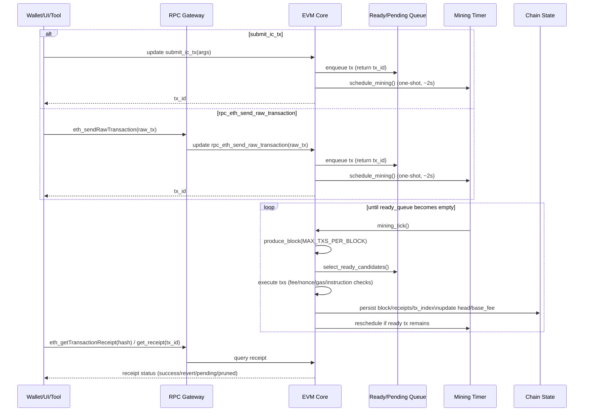

# Kasane Chain (Testnet Alpha): EVM Execution Canister on ICP

Hello everyone — this is an introduction to **Kasane Chain**. We have two simple goals:

1. **Strengthen the connection between ICP and EVM**, so EVM tools and workflows can be used on ICP more naturally.
2. **Improve the developer experience (DX)** for building and operating EVM applications on ICP — including usability, operations, and observability.

## What’s unique (what you can do)

### 1) A canister that embeds an EVM execution engine

Kasane embeds an EVM execution engine **inside a canister** and runs with a simple lifecycle: **submit → queue → produce blocks**.  
The important point is that this is **not** “connecting to an external EVM node.” EVM state transitions and block production happen **inside the canister**.

### 2) A canister-native way to execute EVM transactions without Ethereum signatures

In addition to signed raw transactions (`rpc_eth_send_raw_transaction`), Kasane provides a canister-native path called `submit_ic_tx`.

- `submit_ic_tx` takes typed fields: `to / value / gas / nonce / fee / data` — **no Ethereum signature required**.
- The EVM sender (`from`) is derived deterministically from the caller’s **Principal** (`msg_caller`).
- Authorization is decided in ICP context (for example, the caller must not be anonymous).
- `submit_ic_tx` can be called directly by any **non-anonymous IC identity**.

As a result, **a canister can execute EVM transactions on Kasane without using tECDSA**.

### 3) RPC delivery model (canister methods + gateway)

- The canister itself exposes `rpc_eth_*` methods.
- To reduce friction with the EVM ecosystem, we also provide an HTTP JSON-RPC endpoint: https://rpc-testnet.kasane.network
- This endpoint acts as a **gateway**, translating JSON-RPC requests into canister calls.
- The gateway implementation is open source: https://github.com/kasane-network/rpc-gateway
- The JSON-RPC compatibility matrix is here: https://github.com/kasane-network/rpc-gateway/blob/main/README.md

### 4) Block production mechanism (current implementation)

At a high level, block production is driven by internal canister queues and timers — not by a resident process.  
`submit_*` only enqueues work; execution is handled by automatic production. In that sense, the operating model is **serverless-like**: no mining loop process is required, and progression happens inside the canister.

1. When `submit_ic_tx` / `rpc_eth_send_raw_transaction` succeeds, schedule a production tick
2. On a one-shot timer tick (default: 2 seconds), fetch executable candidates from `ready_queue`
3. Select candidates by fee priority and nonce consistency (nonce gaps are not allowed)
4. Execute sequentially within block gas and instruction constraints; record failures with `drop_code`
5. If any transactions succeed, persist block/receipts/index and update head/base fee
6. If executable transactions remain, schedule the next tick; otherwise wait

```mermaid
sequenceDiagram
  participant Client as Wallet/UI/Tool
  participant Gateway as RPC Gateway
  participant Core as EVM Core
  participant Queue as Ready/Pending Queue
  participant Timer as Mining Timer
  participant State as Chain State

  alt submit_ic_tx
    Client->>Core: update submit_ic_tx(args)
    Core->>Queue: enqueue tx (return tx_id)
    Core->>Timer: schedule_mining() (one-shot, ~2s)
    Core-->>Client: tx_id
  else rpc_eth_send_raw_transaction
    Client->>Gateway: eth_sendRawTransaction(raw_tx)
    Gateway->>Core: update rpc_eth_send_raw_transaction(raw_tx)
    Core->>Queue: enqueue tx (return tx_id)
    Core->>Timer: schedule_mining() (one-shot, ~2s)
    Core-->>Client: tx_id
  end

  loop until ready_queue becomes empty
    Timer->>Core: mining_tick()
    Core->>Core: produce_block(MAX_TXS_PER_BLOCK)
    Core->>Queue: select_ready_candidates()
    Core->>Core: execute txs (fee/nonce/gas/instruction checks)
    Core->>State: persist block/receipts/tx_index\nupdate head/base_fee
    Core->>Timer: reschedule if ready tx remains
  end

  Client->>Gateway: eth_getTransactionReceipt(hash) / get_receipt(tx_id)
  Gateway->>Core: query receipt
  Core-->>Client: receipt status (success/revert/pending/pruned)
```

### 5) Gas specification

Kasane uses an **EIP-1559-style fee model**. Key points:

1. Major default constants (runtime defaults)
   - `base_fee`: `250_000_000_000` wei (250 gwei)
   - `min_gas_price`: `250_000_000_000` wei (legacy lower bound)
   - `min_priority_fee`: `250_000_000_000` wei
   - `block_gas_limit`: `12_000_000` (we’re validating a phased expansion of this upper bound)
2. Effective gas price (EIP-1559)
   - `effective_gas_price = min(max_fee_per_gas, base_fee + max_priority_fee_per_gas)`
   - Reject if `max_priority_fee_per_gas > max_fee_per_gas` or `max_fee_per_gas < base_fee`
   - Related limits: `MAX_TX_SIZE = 128 * 1024`, `MAX_TXS_PER_BLOCK = 1024`
3. `base_fee` update
   - Updated per block using an EIP-1559-compatible formula (`ELASTICITY_MULTIPLIER = 2`, `BASE_FEE_MAX_CHANGE_DENOMINATOR = 8`)
4. Supported transaction types
   - Supported: Legacy / EIP-2930 / EIP-1559  
   - Not supported: EIP-4844 (type=0x03), EIP-7702 (type=0x04)

### 6) IC query transactions and update intents

The query precompile supports ordinary IC queries inside EVM transactions. Execution detects a request, discards provisional effects, reserves the transaction and its block context, then makes one replicated inter-canister call with a fixed two-second bounded wait. The saved response is injected into execution against the same starting state. The final state, nonce, fees, receipt and single-transaction block commit together.

Earlier ordinary transactions seal first. Later transactions remain queued while the query is pending. Native deposits pulled during this interval are credited after it finishes. Late or duplicate callbacks are ignored by attempt ID and phase; upgrade interrupts rather than resends the call. A controller-managed tx allowlist authorizes ordinary query methods only. Target implementations and upgrade controllers are part of the trust boundary because ordinary inter-canister calls cannot enforce a query-only method. Remote prices may change; contracts must check freshness, deadlines and slippage.

Update intents are recorded by execution and dispatched after block commit. Their external effects do not participate in EVM revert atomicity. See [query tx operations](query-tx.md) for ABI, estimation and recovery.

### 7) (Work in progress) Wrap / Unwrap flow overview

This section summarizes the current Wrap/Unwrap compatibility flow between ICP and Kasane, including status tracking and recovery paths.

1. Wrap (ICP → Kasane)
   - Enqueue with `submit_wrap_request`; after the worker executes `icrc2_transfer_from` (pull), mint on Kasane via `submit_ic_tx`
   - If mint fails, keep a refund path via `withdraw_failed_wrap` with `mint_failed_recoverable=true`
2. Unwrap (Kasane → ICP)
   - Requests submitted from the gateway via `submit_unwrap_request` are processed by the wrap canister worker, which executes `icrc1_transfer` and stores `Succeeded/Failed` plus `ledger_tx_id / error_code`

## Notes

- Anonymous callers are rejected: `submit_ic_tx` / `rpc_eth_send_raw_transaction` do not accept anonymous calls.
- Pruning: older history is pruned, so `Pruned` / `PossiblyPruned` may be returned depending on range. Long-term history is retained on the indexer side.
- Block tags: `latest/pending/safe/finalized/earliest/number` are accepted, but `safe/finalized` are currently treated the same as `latest`.  
  For past blocks in `eth_call` / `eth_estimateGas` (`earliest` or `number` other than head), the result is `exec.state.unavailable`.  
  For `eth_getTransactionCount`, `pending` returns the pending nonce.
- Finality model: the current implementation does not assume reorgs; blocks produced by auto-production are treated as final operationally.
- Signed path coverage: `rpc_eth_send_raw_transaction` does not support EIP-4844 (type=0x03) or EIP-7702 (type=0x04).
- Security note: this is still **Testnet Alpha**. Continuous validation is ongoing, but a high-assurance security review is still ahead.

## Current status

- **Testnet Alpha is live**
- Current operational info (as documented in the repo):
  - Network: `Kasane`
  - Chain ID: `4801360`
  - EVM canister: `4c52m-aiaaa-aaaam-agwwa-cai`
  - Native token: `ICP` (`1 ICP = 10^18` smallest unit)
  - RPC: https://rpc-testnet.kasane.network
  - Explorer: https://explorer-testnet.kasane.network

## What we’d like feedback on

Please share candid, near-production feedback:

1. For DEX / app developers
   - Where are the pain points in `submit_ic_tx` and the RPC paths?
   - Are nonce retrieval/tracking and error interpretation straightforward to implement?
3. For builders combining Kasane × IC
   - What concerns remain around Wrap/Unwrap UX or safety?
   - What APIs/samples/guides are missing for canister integration?
4. Looking for collaborators / testers
   - People who want to try DEX/apps on Kasane
   - People who want to build ICP-integrated use cases

## Links

- Faucet: https://testnet-faucet.kasane.network  
- Demo DEX (UI canister): https://rlhjx-iyaaa-aaaaf-qcnyq-cai.icp0.io  
- Docs: https://kasane-network.github.io/kasane-docs/en  
- GitHub: https://github.com/orgs/kasane-network  
- X: https://x.com/kasane_ic  
