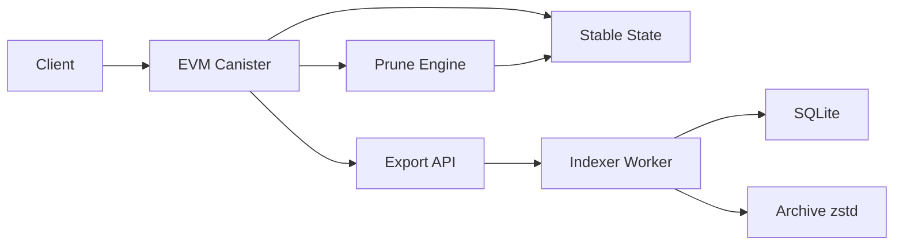
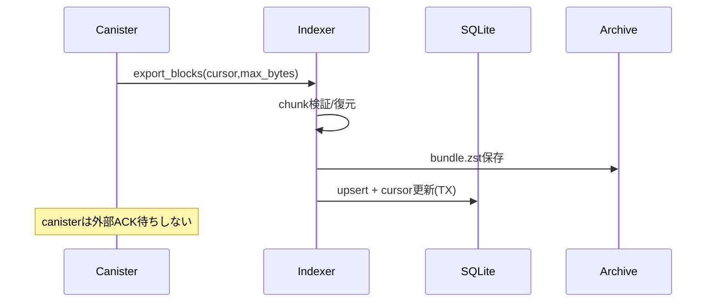
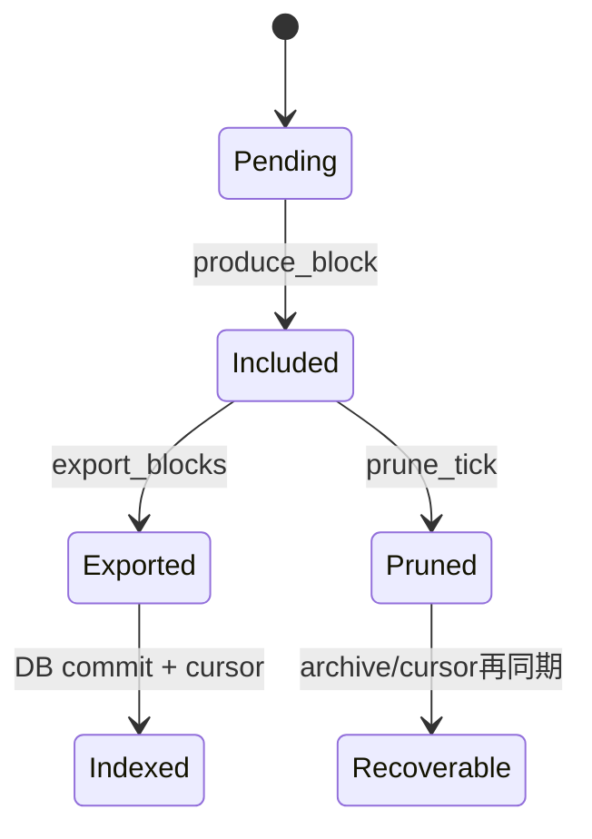

# IC-EVM Whitepaper (Draft)

## 1. Abstract
本書は、ICP上で動作するEVM互換チェーンの現行実装と、運用可能性を優先した設計方針を定義する。主眼は、(a) ブロック生成・状態遷移の再現性、(b) 外部Index/Archive障害時でもチェーン本体が継続する非依存性、(c) pruningとexportを両立するデータ運用である。現時点での実装は `IcSynthetic` 経路と `EthSigned` 経路を持ち、cursor/chunkベースのExport APIとSQLite indexerを備える。一方、PrecompileによるICPトークン相互運用は未実装であり、計画段階として明示する。

### 1.1 Canonical Specs (Source of Truth)
- 現行の運用仕様（RPC公開面、運用上の決定事項、互換方針）は `README.md` を正本とする。
- Indexer/export/pruneの実装仕様は `docs/specs/indexer-v1.md` を正本とする。
- 障害時運用（reject/trap時の扱い、復旧導線）は `docs/ops/indexer-runbook.md` を正本とする。
- 本書は設計背景と全体方針を記述する。矛盾がある場合は上記3文書を優先する。

## 2. Problem

### 2.1 現実的な痛み
- EVM互換を維持しつつ、IC運用制約（メモリ上限、クエリサイズ、アップグレード復旧）に耐える必要がある。
- フル履歴保持だけではストレージコストが増え、長期運用で停止リスクが上がる。
- 外部Indexer/DBを必須依存にすると、外部障害がチェーン停止要因になる。

### 2.2 既存案の限界
- 「L2前提の異議申し立て（fraud/challenge）」をそのまま適用すると、現行の単一チェーン運用と責務がズレる。
- データ提供を1-shot APIに寄せると、追いつき・再開・prune境界処理が壊れやすい。

## 3. Goals / Non-Goals

### Goals
- EVM互換トランザクション実行（`EthSigned` / `IcSynthetic`）を継続提供する。
- Export APIをcursor/chunk化し、再開可能な取り込みを実現する。
- pruningをjournal復旧付きで実装し、クラッシュ後に前進可能にする。
- 外部DB/Archiveをキャッシュ化し、チェーン本体との信頼境界を明確化する。

### Non-Goals
- L2ロールアップ前提のfraud proof/challengeプロトコル実装。
- Precompile経由のICPトークン完全互換（現時点は未実装）。
- 分散sequencer前提の順序保証（現実装の責務外）。

## 4. System Overview

| 役割 | 主責務 | 信頼境界 |
|---|---|---|
| EVM Canister | Tx受付、実行、ブロック生成、状態管理、export/prune提供 | 正本 |
| ICP Subnet / IC Synthesis | 最終性・複製実行 | 正本の下位前提 |
| Indexer (TS) | pull、chunk復元、SQLite保存、archive保存 | キャッシュ |
| SQLite | 検索高速化、cursor永続 | キャッシュ |
| Object Archive(.zst) | prune前の補助保全 | キャッシュ |

## 5. Architecture



### 5.1 実行層
- `produce_block` がmempoolから実行可能Txを選抜し、state root更新・receipt保存・block確定を行う。
- `inspect_message` と本体updateの双方でanonymous拒否し、fail-closed運用。

### 5.2 データ層
- 正本はcanisterのstable state（accounts/storage/blocks/receipts/tx_index）。
- Indexer側のSQLite/Archiveは再構築可能キャッシュ。

### 5.3 検証層
- state rootは永続ノードDB方式へ移行済み（migration phase管理）。
- サンプリング検証カウンタを保持し、ミスマッチ監視を可能化。

### 5.4 運用層
- prune statusを定期pollしてindexer metaへ保存。
- hard emergencyを含む水位制御で容量劣化を抑制。

## 6. Protocol Spec

### 6.1 Tx取り扱い・ブロック生成
- 入口Tx型: `EthSigned` / `IcSynthetic`。
- `IcSynthetic` は caller principal / canister id / tx_bytes を保持する内部経路。
- `produce_block(max_txs)` は権限制御付きで実行。

### 6.2 チェーン内最終性・フォールトモデル
- チェーン確定はIC Synthesis（ICP subnet finality）を前提にする。
- 実装上の用語対応:
  - 概念: IC Synthesis確定
  - 実装: `IcSynthetic` Tx経路（※用語は同一ではない）

### 6.3 Export API / chunking / cursor（2MiB制約を考慮）
- API: `export_blocks(cursor, max_bytes)`。
- 実装上限: `MAX_EXPORT_BYTES = 1,500,000` bytes（約1.5MiB、2MiB未満に制限）。
- 分割方式: 1 blockを3 segment（block/receipts/tx_index）に分け、`segment + byte_offset` で追跡。
- 上限制御: `MAX_EXPORT_BLOCKS=64`, `MAX_SEGMENT_LEN=8MiB`。
- 追いつき時: `chunks=[]` + `next_cursor=cursor` を返す。
- prune越境時: `Pruned{pruned_before_block}` を返す。

### 6.4 Indexer設計
- pull loop: head取得 → export呼び出し → chunk検証 → decode → archive → DB commit → cursor更新。
- DB: SQLite（upsert中心、migration管理）。
- archive: block単位 `.bundle.zst`（atomic rename）。
- cursor永続: DBトランザクション内で更新。

### 6.5 Pruning設計
- `should_prune` 相当は `need_prune`（水位/日数トリガ）で判定。
- BlobStore lifecycle: `mark_quarantine -> prune_journal記録 -> index削除 -> mark_free`。
- crash recovery: `recover_prune_journal` が再開時に未完了削除を回復。

### 6.6 Precompile計画（未確定）
- 目的: EVMからICPトークン（ICRC-1/2想定）連携、ICP向け送信を提供。
- 現状: 未実装。I/F、権限、再送・重複防止、課金モデルは未確定。

## 7. Security Model

### 7.1 脅威モデル
| 脅威 | 前提 | 現対策 | 反証可能性 |
|---|---|---|---|
| 検閲/順序偏り | 生成権限集中 | allowlist、監視メトリクス | ブロック内順序統計で検証可能 |
| データ欠損 | prune後アクセス | Prunedエラー明示、archive補助 | 欠損率・復旧率で検証可能 |
| リプレイ | 重複submit | tx_id/nonceルール | 同hash再投入テスト可能 |
| DoS | 大量/不正入力 | inspect境界、maxサイズ、queue上限 | 負荷試験で検証可能 |
| 実装バグ | decode/commit不整合 | エラー分類、テスト群 | differential testで検証可能 |

### 7.2 失敗モード
| 失敗モード | チェーン本体 | Indexer | 期待挙動 |
|---|---|---|---|
| SQLite破損 | 継続 | 停止 | DB再構築で復旧 |
| Archive書込失敗 | 継続 | 停止 | 空き容量復旧後再開 |
| export一時失敗 | 継続 | リトライ | backoffで収束 |
| prune途中クラッシュ | 継続再起動 | 影響なし | journal回復で前進 |

### 7.3 「外部DBはキャッシュ」の定義
- 定義: 外部DB/Archiveが完全停止しても、`submit_*` / `produce_block` / state更新が継続できること。
- 根拠: chain正本はstable stateのみで完結し、pruneも外部ACK非依存。
- 境界: 履歴参照の利便性は低下するが、コンセンサス状態は変化しない。

## 8. Data Availability

| 項目 | 方針 |
|---|---|
| 正本保持 | ICP内部stable state |
| 外部保持 | SQLite/Archiveは補助キャッシュ |
| 欠損時 | export再取得、cursor再開、必要時archive復元 |
| prune後 | `Pruned`を返し、境界を明示 |



## 9. Verification Strategy

- 実行再現性: 同入力に対するstate root/receipt整合をテストで担保。
- 境界検証: cursor単調性、chunk連続性、payload_len一貫性を検査。
- 不整合検知: decode失敗・cursor不整合はfatal分類で停止。
- 回復: cursor起点で再取得、prune境界は`Pruned`で分岐。



## 10. Economics

### 10.1 コスト要素
- Canister側: 実行・保存・prune処理のcycle。
- Indexer側: ネットワークI/O、SQLite I/O、zstd圧縮、ディスク。

### 10.2 見積枠組み（未確定）
- 1blockあたり raw bytes / compressed bytes / tx数 を日次集計。
- pruning policyは `bytes/day × retain_days × headroom` で算定。
- 手数料の最終パラメータ（base fee運用値）は未確定。

## 11. Operations

### 11.1 Runbook要約
- 起動: canister起動後、indexerはarchive GC→pull loop開始。
- 停止: SIGINT/SIGTERMで安全停止（cursorはコミット単位）。
- 復旧: Pruned/InvalidCursor/ArchiveIOごとに分岐。

### 11.2 段階的ON
1. prune policy投入（enabled=false）
2. `get_prune_status`監視
3. enabled=true + 小さい`max_ops_per_tick`で開始

### 11.3 監視メトリクス
- head, cursor_lag, need_prune, pruned_before_block
- blocks_ingested, raw/compressed/sqlite/archive bytes
- fatal種別（Pruned/InvalidCursor/Decode/ArchiveIO/Db）

## 12. Roadmap

| Phase | 内容 | 状態 |
|---|---|---|
| A | Export/Indexer/prune基盤 | 実装済み |
| B | state root永続化 + migration | 実装済み |
| C | 運用強化（監視・runbook） | 進行中 |
| D | Precompile I/F設計（ICP token/送信） | 未着手 |
| E | 互換性・負荷・差分検証拡張 | 進行中 |

次の3タスク:
1. Precompile仕様（I/F・権限・冪等ID）を固定
2. differential test（参照実装突合）をCI化
3. pruning容量パラメータを実測で再調整

## 13. Risks & Open Questions

- **未確定**: Precompileの責務境界（Ingress検証との分離）。
- **未確定**: ICRC-1/2対象範囲（transfer/approve/metadata）。
- リスク: pruning過剰でindex追いつき失敗（Pruned停止）。
- リスク: 単一実装由来の仕様解釈差分。

## 14. Appendix

### 14.1 用語集
- `IcSynthetic`: IC caller情報を含む内部Tx経路。
- `ExportCursor`: `{block_number, segment, byte_offset}`。
- `Pruned`: export対象が既に削除された境界エラー。

### 14.2 主要データ構造
| 構造 | 主フィールド |
|---|---|
| Cursor | block_number, segment, byte_offset |
| Chunk | segment, start, bytes, payload_len |
| BlobPtr | class, offset/len（実装依存） |

### 14.3 疑似コード

```text
function export(cursor,max_bytes):
  clamp(max_bytes, 1..1_500_000)
  if cursor <= pruned_before: return Pruned
  while remaining>0 and blocks<64:
    payloads = [block,receipts,tx_index]
    emit chunk by (segment,offset)
  return chunks,next_cursor
```

```text
function ingest_loop():
  result = export_blocks(cursor,max_bytes)
  verify cursor/chunk continuity
  decode payloads
  archive write
  tx { upsert block/tx; set cursor }
```

```text
function prune_tick():
  if !need_prune: return
  recover_prune_journal()
  for block in old_range:
    mark_quarantine(ptrs)
    write journal
    delete indices/data
    mark_free(ptrs)
    clear journal
```

---

## 矛盾チェック
- 「2MiB制限」要件と現実装値は一致しない（実装は1.5MiB）。本書では「2MiB未満運用」として整合化。
- 「IC Synthesis」と「IcSynthetic」は同語ではないため、概念と実装名を分離して記述。
- L2用語（sequencer/fraud proof）は本文から除外済み。

## 未確定一覧
1. PrecompileのAPI仕様（関数ID、引数、戻り値、エラーコード）
2. ICPトークン互換の対象範囲（ICRC-1/2のどこまで）
3. ICP向け送信の再送戦略と重複排除キー
4. 経済パラメータ（feeレンジ、運用閾値の本番値）

## 追加で必要な実測
1. block/txあたりraw・圧縮サイズ分布
2. cursor_lag分布とPruned発生条件
3. prune実行時間と`max_ops_per_tick`の相関
4. state root commit時間（touched件数別）
5. indexer停止/再開時の追いつき所要時間

## 実装に落とすToDo（上から順）
1. Precompile仕様ドラフトを`docs/`に固定する
2. ICRC互換範囲の最小セットを決める
3. ICP送信の冪等ID設計を決める
4. Precompile read-only PoCを実装する
5. write系Precompileに権限制御を追加する
6. differential testをCIで定期実行する
7. pruningパラメータを実測ベースで再設定する
8. runbookに障害別SLOを追加する
